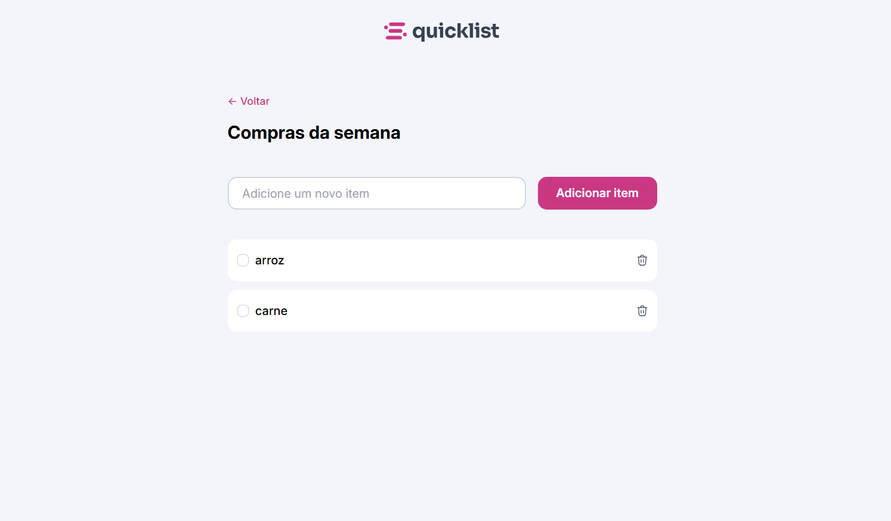

[PROJECT__BADGE]: https://img.shields.io/badge/📱Project_online_preview-000?style=for-the-badge&logo=project
[PROJECT__URL]: https://rafaelfidelisss.github.io/QuickList-JS/

<h1 align="center"> Lista de compras </h1>

  <a href="#-tecnologias">Tecnologias</a>&nbsp;&nbsp;&nbsp;|&nbsp;&nbsp;&nbsp;
  <a href="#-tecnologias">Funcionalidades</a>&nbsp;&nbsp;&nbsp;|&nbsp;&nbsp;&nbsp;
  <a href="#-projeto">Projeto</a>

 

  

## 💻 Projeto

Uma página simples de lista de compras.  
Projeto desenvolvido para praticar manipulação de elementos com JavaScript.

[![project][PROJECT__BADGE]][PROJECT__URL]

## ⚙️ Funcionalidades

- Adicionar elemento na lista
- Marcar elemento na lista
- Remover elemento da lista

## 🚀 Tecnologias

Esse projeto foi desenvolvido com as seguintes tecnologias:

- HTML
- CSS
- JavaScript
